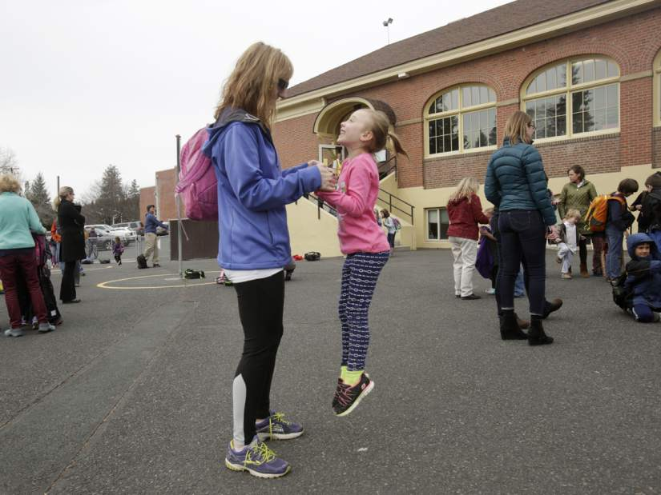
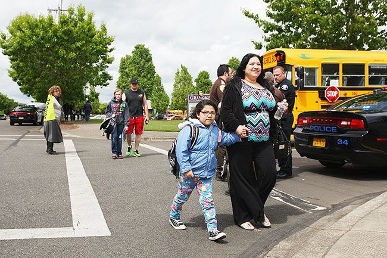

```{r setup, include=FALSE}
knitr::opts_chunk$set(echo = FALSE, warning=FALSE, message=FALSE)
load(".rdata")
library('tidyverse')
library('stringr')
library('ggmap')
library('ggplot2')
library('maps')
library('scales')
library('splitstackshape')
library('ggrepel')
library('lettercase')
library('waffle')
library('googlesheets')
```

# Outdoor School in Oregon {.section-title .title-page .ods-blue}


# Background {.section-title .kids-on-bridge .ods-blue}

## There are a LOT of schools that serve fifth or sixth graders in Oregon! {.ods-blue}

```{r map of all schools in Oregon}
ggplot() +
  geom_polygon(data = oregon.map, 
               aes(x=long, y=lat, group=group),
               color = ods.gray,
               fill = ods.light.gray) +
  geom_point(data = schools.data,
             color = ods.dark.gray,
             aes(x = lon, y = lat)) +
  ods.map.theme
```


# Outdoor School Participation {.section-title .smiling-kid .ods-blue}

## Most students who participated in Outdoor School in 2016-2017 were in sixth grade {.ods-blue}

```{r number of students}
ggplot(number.of.students, aes(x = grade, y = number_of_students, 
                               fill = factor(grade),
                               color = factor(grade))) +
  geom_bar(stat = "identity") +
  geom_text(label = comma(number.of.students$number_of_students),
            hjust = -.2, 
            size = ods.text.size * .3) +
  scale_fill_manual(values = c(ods.dark.gray, ods.blue, ods.dark.gray)) +
  scale_color_manual(values = c(ods.dark.gray, ods.blue, ods.dark.gray)) +
  scale_y_continuous(limits = c(0, 25000)) +
  coord_flip() +
  ods.bar.theme
```


## 493 schools (64 percent of the total) participated in Outdoor School {.ods-blue}
```{r number of schools}
waffle(ods.participation.by.general.waffle,
       rows = 25,
       color = c(ods.blue, ods.red),
       legend_pos = "none") 
```


## Large schools are slightly more likely to participate in Outdoor School than are small schools {.ods-blue}

```{r participation by size}
ggplot(ods.participation.by.size, aes(x = grouping, y = pct)) +
    geom_bar(stat = "identity",
             fill = c(ods.dark.gray, ods.blue)) +
    geom_text(label = percent(ods.participation.by.size$pct),
              hjust = -.2,
              color = c(ods.dark.gray, ods.blue),
              size = ods.text.size * .35) + 
    scale_y_continuous(limits = c(0, max(ods.participation.by.size$pct + .1)), 
                       labels = percent) +
    coord_flip() +
    ods.bar.theme

```


## Private schools are more likely to participate in Outdoor School than are public schools {.ods-blue}

```{r participation by governance}
ggplot(ods.participation.by.governance, aes(x = grouping, y = pct)) +
    geom_bar(stat = "identity",
             fill = c(ods.blue, ods.dark.gray)) +
    geom_text(label = percent(ods.participation.by.governance$pct),
              hjust = -.2,
              color = c(ods.blue, ods.dark.gray),
              size = ods.text.size * .35) + 
    scale_y_continuous(limits = c(0, max(ods.participation.by.governance$pct + .1)), 
                       labels = percent) +
    coord_flip() +
    ods.bar.theme

```


## What do you expect the relationship between race/ethnicity and Outdoor School participation to be? {.ods-blue}


## There is no association between Outdoor School participation rates and the race/ethnicity makeup of schools {.ods-blue}

```{r participation by race}
ggplot(ods.participation.by.whiteness, aes(x = grouping, y = pct)) +
    geom_bar(stat = "identity",
             fill = ods.dark.gray) +
    geom_text(label = percent(ods.participation.by.whiteness$pct),
              hjust = -.2,
              color = ods.dark.gray,
              size = ods.text.size * .35) + 
    scale_y_continuous(limits = c(0, max(ods.participation.by.whiteness$pct + .1)),
                       labels = percent) +
    coord_flip() +
    ods.bar.theme

```


## What do you expect the relationship between poverty and Outdoor School participation to be? {.ods-blue} 


## High-poverty schools are less likely to participate in Outdoor School {.ods-blue}

```{r participation by poverty}
ggplot(ods.participation.by.frl, aes(x = grouping, y = pct)) +
    geom_bar(stat = "identity",
             fill = ods.participation.by.frl$fill) +
    geom_text(label = percent(ods.participation.by.frl$pct),
              hjust = -.2,
              color = ods.participation.by.frl$color,
              size = ods.text.size * .35) + 
    scale_y_continuous(limits = c(0, max(ods.participation.by.frl$pct + 1)), labels = percent) +
    coord_flip() +
    ods.bar.theme

```


## Schools with higher rates of proficiency on statewide science tests are more likely to participate in Outdoor School {.ods-blue}
```{r participation by test scores}
ggplot(ods.participation.by.test.scores, aes(x = grouping, y = pct,
                                             fill = factor(test_type),
                                             color = factor(test_type))) +
    geom_bar(stat = "identity") +
    geom_text(label = percent(ods.participation.by.test.scores$pct),
              hjust = -.2,
              size = ods.text.size * .35) + 
    scale_fill_manual(values = c(ods.dark.gray, ods.dark.gray, ods.blue)) +
    scale_color_manual(values = c(ods.dark.gray, ods.dark.gray, ods.blue)) +
    scale_y_continuous(limits = c(0, 1)) +
    scale_x_discrete(labels = rev(ods.participation.by.test.scores.labels)) +
    facet_wrap(~test_type) +
    coord_flip() +
    ods.bar.theme.faceted 
```


# Geography of participation {.kids-on-beach .section-title .ods-blue}

## Schools that participated in Outdoor School {.ods-blue}

```{r map of schools that participated}
ggplot() +
  geom_polygon(data = oregon.map, 
               aes(x=long, y=lat, group=group),
               color = ods.gray,
               fill = ods.light.gray) +
  geom_point(data = filter(schools.data, Did.your.school.participate.in.Outdoor.School.in.the.2016.2017.school.year. == "Yes"),
             color = ods.blue,
             aes(x = lon, y = lat)) +
  ods.map.theme
```

## Schools that DID NOT participate in Outdoor School {.ods-red}

```{r map of schools that did not participate}
ggplot() +
  geom_polygon(data = oregon.map, 
               aes(x=long, y=lat, group=group),
               color = ods.gray,
               fill = ods.light.gray) +
  geom_point(data = filter(schools.data, Did.your.school.participate.in.Outdoor.School.in.the.2016.2017.school.year. == "No"),
             color = ods.red,
             aes(x = lon, y = lat)) +
  ods.map.theme
```


## There is large variation in Outdoor School participation rates between educational service districts {.ods-blue}
```{r participation by esd}
ggplot(ods.participation.by.esd, aes(x = reorder(grouping, pct), y = pct)) +
  geom_bar(stat = "identity", 
           fill = ods.dark.gray) +
  geom_text(label = percent(ods.participation.by.esd$pct),
            hjust = -.2,
            size = ods.text.size * .35,
            color = ods.dark.gray) + 
  scale_y_continuous(limits = c(0, 1.1), labels = percent) +
  coord_flip() +
  ods.bar.theme

```


## Outdoor School participation rates vary widely, but in five counties fewer than 25 percent of schools participate {.ods-blue} 

```{r participation by county}
ggplot(ods.participation.by.county, aes(x=long, y=lat, group=group, 
                                        fill = factor(pct.text))) +
  geom_polygon(color = "white") +
  scale_fill_manual(name = "Percent participation",
                    values = c("#EAEEF1", "#B6CADD", "#6894BF", ods.blue)) +
  ods.map.theme 
```


# Program Characteristics {.section-title .kids-with-binoculars}

## Most Outdoor School programs last three or four DAYS {.ods-blue}

```{r program length - days}

ggplot(program.length.days, aes(x = length, y = number, 
                                fill = factor(length), color = factor(length))) +
  geom_bar(stat = "identity") +
  geom_text(label = program.length.days$number,
            hjust = -.7,
            size = ods.text.size * .3) +
  coord_flip() +
  scale_color_manual(values = (c(ods.dark.gray, ods.dark.gray, ods.dark.gray,
                                ods.blue, ods.blue,
                                ods.dark.gray, ods.dark.gray))) +
  scale_fill_manual(values = (c(ods.dark.gray, ods.dark.gray, ods.dark.gray,
                                ods.blue, ods.blue,
                                ods.dark.gray, ods.dark.gray))) +
  scale_y_continuous(limits = c(0, 240)) +
  # labs(title = "Days") +
  ods.bar.theme
```


## Most Outdoor School programs last two or three NIGHTS {.ods-blue}
```{r}

ggplot(program.length.nights, aes(x = length, y = number, 
                                fill = factor(length), color = factor(length))) +
  geom_bar(stat = "identity") +
  geom_text(label = program.length.nights$number,
            hjust = -.7,
            size = ods.text.size * .3) +
  coord_flip() +
  scale_color_manual(values = (c(ods.dark.gray, ods.dark.gray, ods.dark.gray,
                                 ods.blue, ods.blue,
                                 ods.dark.gray, ods.dark.gray))) +
  scale_fill_manual(values = (c(ods.dark.gray, ods.dark.gray, ods.dark.gray,
                                ods.blue, ods.blue,
                                ods.dark.gray, ods.dark.gray))) +
  scale_y_continuous(limits = c(0, 240)) +
  # labs(title = "Nights") +
  ods.bar.theme
```


## The curriculum for most Outdoor School programs is developed at least in part by outside providers {.ods-blue}

```{r curriculum development}
ggplot(curriculum.developer, aes(x = reorder(grouping, number), y = number, 
                                 fill = factor(grouping),
                                 color = factor(grouping))) +
  geom_bar(stat = "identity") +
  geom_text(label = curriculum.developer$number,
            hjust = -.7,
            size = ods.text.size * .3) +
  coord_flip() +
  scale_fill_manual(values = c(ods.blue, ods.dark.gray, ods.dark.gray)) +
  scale_color_manual(values = c(ods.blue, ods.dark.gray, ods.dark.gray)) +
  scale_y_continuous(limits = c(0, 335)) +
  ods.bar.theme
```


## Nearly all Outdoor School programs have an academic component {.ods-blue}

```{r academic component}

ggplot(academic.component, aes(x = reorder(response, pct), y = pct, 
                     fill = factor(response),
                     color = factor(response))) +
  geom_bar(stat = "identity") +
  geom_text(data = academic.component,
            label = percent(academic.component$pct),
            hjust = -.5,
            size = ods.text.size * .3) +
  coord_flip() +
  scale_fill_manual(values = c(ods.dark.gray, ods.blue, ods.dark.gray)) +
  scale_color_manual(values = c(ods.dark.gray, ods.blue, ods.dark.gray)) +
  scale_x_discrete(labels = function(response) str_wrap(response, width = 35)) +
  scale_y_continuous(limits = c(0, 1.1)) +
  ods.bar.theme

```


## In addition to teachers, camps and providers are the main source of staff for Outdoor School programs {.ods-blue}

```{r staffing}

ggplot(staffing, aes(x = reorder(staffer, number), y = number, 
                     fill = factor(staffer),
                     color = factor(staffer))) +
  geom_bar(stat = "identity") +
  geom_text(data = staffing,
            label = staffing$number,
            hjust = -.5,
            size = ods.text.size * .3) +
  coord_flip() +
  scale_fill_manual(values = rev(c(ods.dark.gray, ods.dark.gray, ods.dark.gray, ods.blue))) +
  scale_color_manual(values = rev(c(ods.dark.gray, ods.dark.gray, ods.dark.gray, ods.blue))) +
  scale_y_continuous(limits = c(0, 270)) +
  ods.bar.theme

```


## The vast majority of schools make all accommodations necessary to ensure that all students can participate in Outdoor School {.ods-blue}

```{r accommodations}
ggplot(accommodations, aes(x = reorder(response, number), y = number, 
                           fill = factor(response),
                           color = factor(response))) +
  geom_bar(stat = "identity") +
  geom_text(label = accommodations$number,
            hjust = -.5,
            size = ods.text.size * .3) +
  coord_flip() +
  scale_fill_manual(values = c(ods.blue, ods.dark.gray, ods.dark.gray)) +
  scale_color_manual(values = c(ods.blue, ods.dark.gray, ods.dark.gray)) +
  scale_y_continuous(limits = c(0, 210)) +
  ods.bar.theme
```


## Most Outdoor School programs have existed for ten years or less {.ods-blue}
```{r program length in existence}
ggplot (ods.program.length, aes(x = length, y = number,
                                fill = factor(length),
                                color = factor(length))) +
  geom_bar(stat = "identity") +
  geom_text(label = ods.program.length$number,
            hjust = -.5,
            size = ods.text.size * .3) +
  scale_fill_manual(values = c(rep(ods.dark.gray, times = 5), ods.blue)) +
  scale_color_manual(values = c(rep(ods.dark.gray, times = 5), ods.blue)) +
  scale_y_continuous(limits = c(0, 100)) +
  coord_flip() +
  ods.bar.theme
```


# Camps {.section-title .camps .ods-green}

## Camps that hosted five or more schools for Outdoor School in 2016-2017 {.ods-green}

```{r number of schools each camp hosts}
ggplot(camps.number.of.schools.graph, aes(x = reorder(Camp.Name, number_of_schools), y = number_of_schools, 
                                    fill = factor(Camp.Name),
                                    color = factor(Camp.Name))) +
  geom_bar(stat = "identity") +
  geom_text(label = camps.number.of.schools.graph$number_of_schools,
            hjust = -.5, 
            size = ods.text.size * .25) +
  scale_fill_manual(values = c(rep(ods.dark.gray, times = 21), ods.blue,
                               rep(ods.dark.gray, times = 16))) +
  scale_color_manual(values = c(rep(ods.dark.gray, times = 21), ods.blue,
                               rep(ods.dark.gray, times = 16))) +
  scale_y_continuous(limits = c(0, 55)) +
  coord_flip() +
  ods.bar.theme
```


## Some camps, such as Camp Gray, host schools from across Oregon {.ods-green}

```{r camp gray}
ggplot() +
  geom_polygon(data=oregon.map, 
               aes(x=long, y=lat, group=group), 
               fill=ods.light.gray, 
               color = ods.gray,
               alpha=0.5) +
  geom_text(data = camps.with.associated.schools.gray[1,],
            aes(x = lon.camp, y = lat.camp),
            label = "Camp Gray",
            color = ods.green,
            vjust = 1.8,
            size = ods.text.size * .3) +
  geom_point(data = camps.with.associated.schools.gray[1,],
             color = ods.green,
             size = 5,
             aes(x = lon.camp, y = lat.camp)) +
  geom_point(data = camps.with.associated.schools.gray,
             color = ods.blue,
             aes(x = lon.school, y = lat.school)) +
  ods.map.theme
```


## Some camps, such as Camp Tamarack, host mostly nearby schools {.ods-green}

```{r camp tamarack}
ggplot() +
  geom_polygon(data=oregon.map, 
               aes(x=long, y=lat, group=group), 
               fill=ods.light.gray, 
               color = ods.gray,
               alpha=0.5) +
  geom_text(data = camps.with.associated.schools.tamarack[1,],
            aes(x = lon.camp, y = lat.camp),
            label = "Camp Tamarack",
            color = ods.green,
            hjust = 1.1,
            size = ods.text.size * .3) +
  geom_point(data = camps.with.associated.schools.tamarack[1,],
             color = ods.green,
             size = 5,
             aes(x = lon.camp, y = lat.camp)) +
  geom_point(data = camps.with.associated.schools.tamarack,
             color = ods.blue,
             aes(x = lon.school, y = lat.school)) +
  ods.map.theme

```


## Camps that host the most schools are concentrated in Northwestern and Central Oregon {.ods-green}

```{r map of camps}
ggplot(camps.number.of.schools, aes(group = Camp.Name)) +
  geom_polygon(data=ods.states.map, 
               aes(x=long, y=lat, group=group), 
               fill=ods.light.gray, 
               color = ods.gray,
               alpha=0.5) +
  geom_point(data = camps.number.of.schools,
             color = ods.green,
             aes(x = lon, y = lat),
             size = camps.number.of.schools$number_of_schools / 2,
             alpha = 0.75) +
  ods.map.theme

```


# Past and Future Programs {.section-title .streamable}

## Of schools that did not participate in Outdoor School 2016-2017, most say they have never participated {.ods-red}

```{r participated in past}

ggplot(participated.in.past, aes(x = response, y = pct, 
                              fill = factor(response),
                              color = factor(response))) +
  geom_bar(stat = "identity") +
  geom_text(label = percent(participated.in.past$pct),
            hjust = -.7,
            size = ods.text.size * .3) +
  coord_flip() +
  scale_fill_manual(values = c("white", ods.red, ods.dark.gray)) +
  scale_color_manual(values = c(ods.dark.gray, ods.red, ods.dark.gray)) +
  scale_y_continuous(limits = c(0, .55)) +
  ods.bar.theme

```


## The most common previous year of involvement was 2015-2016 {.ods-red}

```{r previous year of participation}

ggplot(last.participated, aes(x = year, y = number, 
                              fill = factor(year),
                              color = factor(year))) +
  geom_bar(stat = "identity") +
  geom_text(label = last.participated$number,
            hjust = -.7,
            size = ods.text.size * .3) +
  coord_flip() +
  scale_fill_manual(values = c(rep(ods.dark.gray, times = 9), ods.red)) +
  scale_color_manual(values = c(rep(ods.dark.gray, times = 9), ods.red)) +
  ods.bar.theme

```


## Many schools without current Outdoor School programs last attended Hancock Field Station and Camp Westwind {.ods-red}

```{r previous camp}
ggplot(last.participated.camp, aes(x = reorder(camp, number), y = number, 
                                   fill = factor(camp),
                                   color = factor(camp))) +
  geom_bar(stat = "identity") +
  geom_text(label = last.participated.camp$number,
            hjust = -.7,
            size = ods.text.size * .3) +
  scale_fill_manual(values = c(rep(ods.dark.gray, times = 9), ods.red, ods.dark.gray, ods.red, rep(ods.dark.gray, times = 3))) +
  scale_color_manual(values = c(rep(ods.dark.gray, times = 9), ods.red, ods.dark.gray, ods.red, rep(ods.dark.gray, times = 3))) +
  coord_flip() +
  ods.bar.theme
```


## The most common reasons for dropping Outdoor School programs were cost and a change in the grades involved {.ods-red}

```{r why stopped going}
ggplot(why.stopped.going, aes(x = reorder(reason, number), y = number, 
                              fill = factor(reason),
                              color = factor(reason))) +
  geom_bar(stat = "identity") +
  geom_text(label = why.stopped.going$number,
            hjust = -.7,
            size = ods.text.size * .3) +
  scale_x_discrete(labels = function(reason) str_wrap(reason, width = 35)) +
  scale_fill_manual(values = c(ods.red, ods.red, rep(ods.dark.gray, times = 4))) +
  scale_color_manual(values = c(ods.red, ods.red, rep(ods.dark.gray, times = 4))) +
  coord_flip() +
  ods.bar.theme
```


## Over half of schools without Outdoor School programs say they are very or somewhat interested in starting one {.ods-red}

```{r interest in starting ods}
ggplot(interest.in.ods, aes(x = interest, y = pct, 
                            fill = factor(interest), 
                            color = factor(interest))) +
  geom_bar(stat = "identity") +
  geom_text(label = percent(interest.in.ods$pct),
            hjust = -.5,
            size = ods.text.size * .3) +
  scale_fill_manual(values = c("white", rep(ods.dark.gray, times = 2), ods.red, ods.red)) +
  scale_color_manual(values = c(ods.dark.gray, rep(ods.dark.gray, times = 2), ods.red, ods.red)) +
  scale_y_continuous(limits = c(0, .35)) +
  coord_flip() +
  ods.bar.theme
```


## Of schools with a date in mind to start an Outdoor School program, most plan to start during the 2017-2018 school year, but many are not sure {.ods-red}

```{r when plan to start ods}

ggplot(when.start.program, aes(x = year, y = pct, 
                               fill = factor(year), 
                               color = factor(year))) +
  geom_bar(stat = "identity") +
  geom_text(label = percent(when.start.program$pct),
            hjust = -.5,
            size = ods.text.size * .3) +
  scale_fill_manual(values = c("white", rep(ods.dark.gray, times = 2), ods.red)) +
  scale_color_manual(values = c(rep(ods.dark.gray, times = 3), ods.red)) +
  scale_y_continuous(limits = c(0, .5)) +
  coord_flip() +
  ods.bar.theme

```


# Measure 99 {.section-title .kid-kneeling}

## Most schools say they are somewhat familiar with Measure 99 {.ods-blue}

```{r m99 familiarity}

ggplot(m99.awareness.general, aes(x = m99_awareness, y = pct,
                                  fill = factor(m99_awareness),
                                  color = factor(m99_awareness))) +
  geom_bar(stat = "identity") +
  geom_text(label = percent(m99.awareness.general$pct),
            hjust = -.2,
            size = ods.text.size * .3) +
  coord_flip() +
  scale_fill_manual(values = c(ods.dark.gray, ods.dark.gray, ods.blue, ods.dark.gray)) +
  scale_color_manual(values = c(ods.dark.gray, ods.dark.gray, ods.blue, ods.dark.gray)) +
  scale_y_continuous(limits = c(0, .5)) +
  ods.bar.theme

```


## Schools that DID NOT participate in Outdoor School in 2016-2017 are more likely to be not at all familiar with Measure 99 than are those that DID participate {.ods-blue}

```{r m99 familiarity by participation}

ggplot(m99.awareness.by.ods.participation, aes(x = m99_awareness, y = pct)) +
  geom_bar(stat = "identity",
           fill = m99.awareness.by.ods.participation$fill) +
  geom_text(label = percent(m99.awareness.by.ods.participation$pct),
            hjust = -.2,
            size = ods.text.size * .3,
            color = m99.awareness.by.ods.participation$color) +
  coord_flip() +
  scale_y_continuous(limits = c(0, .5)) +
  facet_wrap(~participation) +
  ods.bar.theme.faceted

```


## Half of schools are not at familiar with Oregon State University Extension Service’s role in funding Outdoor School programs {.ods-blue}

```{r osu extension familiarity}

ggplot(familiarity.with.osu.general, aes(x = familiarity, y = pct,
                                  fill = factor(familiarity),
                                  color = factor(familiarity))) +
  geom_bar(stat = "identity") +
  geom_text(label = percent(familiarity.with.osu.general$pct),
            hjust = -.2,
            size = ods.text.size * .3) +
  coord_flip() +
  scale_fill_manual(values = c(ods.blue, ods.dark.gray, ods.dark.gray, ods.dark.gray)) +
  scale_color_manual(values = c(ods.blue, ods.dark.gray, ods.dark.gray, ods.dark.gray)) +
  scale_y_continuous(limits = c(0, .55)) +
  ods.bar.theme

```


# How do Schools Create Successful Outdoor School Programs? {.section-title .successful-programs .ods-blue}


## Need for multilevel support {.ods-blue}

- Teachers
- Administrators
- District
- Families
- Community

## Teachers: Fundraising has been a big issue {.ods-blue}
<blockquote>In Vale, a small town in Eastern Oregon, Willowcreek Elementary School raises money by recycling cans. Their four-day, three-night Outdoor School program at McCall Outdoor Science School in Idaho, is funded, as teacher Marti Bair put it, “five cents at a time.”</blockquote>

## Organizing the logistics for Outdoor School is a huge task {.ods-blue}

<blockquote>“Teachers at our school spend countless unpaid hours planning and organizing.”</blockquote> 

Ashley Wilson, sixth grade teacher at Conestoga Middle School in Beaverton

## Many schools outsource curriculum development to reduce burden on teachers {.ods-blue}

<blockquote>“I can’t imagine if I had to plan curriculum too.”</blockquote>
Fifth grade teacher Beth Fuhrer at Grandhaven Elementary School in McMinville 

## Teachers have to be willing to spend several days away from their families to participate in Outdoor School {.ods-blue}
<blockquote>Brian Kissell, principal of Highland School in Bend, spoke of being incredibly appreciative of his teachers, who are willing to do what it takes to support their school’s Outdoor School program. A school where he previously worked did not have such support from the teaching staff, and he saw teachers “get bent out of shape” as a result of feeling forced to be involved with Outdoor School.</blockquote>


## Administrators {.ods-blue}

Up to this point, in places without a district-wide Outdoor School policy, they have often been the ones who decide whether or not to participate


## Without district support, even administrators supportive of Outdoor School may not know how to get their schools involved {.ods-blue}

<blockquote>“I don’t think anybody I work with even knows that I’m a passionate Outdoor School supporter.”</blockquote>

## Many families are eager to be involved in Outdoor School {.ods-blue}



## There are often particular reasons why other families may be hesitant to allow their children to participate in Outdoor School {.ods-blue}



# Conclusion {.section-title .conclusion}


## Main takeaways {.ods-blue}

- In the 2016-2017 school year, over 30,000 students participated in Outdoor School.
- Nearly two-thirds of schools participated in Outdoor School in 2016-2017.
- No observable differences with regard to race and Outdoor School participation.
- High-poverty schools are less likely to participate in Outdoor School. 


## Main takeaways {.ods-blue}

- Ninety-five percent of Outdoor School programs have an academic component that connects to state standards.
- The most common length of Outdoor School programs is three days and two nights.
- Outdoor School programs were held at 38 camps in 2016-2017, the vast majority of which were in Northwestern and Central Oregon. 
- Most Outdoor School programs have existed for 10 years or less.


## Main takeaways {.ods-blue}

- Successful Outdoor School programs receive multilevel support from teachers, administrators, districts, and communities. 
- Over half of schools that do not currently participate in Outdoor School are very or somewhat interested in starting programs.
- There is significant confusion among schools about Measure 99.  


## The challenge in funding Outdoor School for all is great {.ods-blue}
- There is a lot of confusion about Measure 99.
- Create a funding structure that works for the diversity of schools in Oregon.
- In addition to funds, having a way to share expertise among schools would benefit those just starting Outdoor School programs.


## The impact of Outdoor School is great as well {.ods-blue}

<blockquote>"Up until Outdoor School, he was a real challenge in the classroom. I connected with him somehow. We got him to the beach. The entire week, he was in awe of the beach. He had never been there. And the kids in the class got to see a different side of him. When he came back from Outdoor School, he had friends. He had a different outlook on school. His grades went up. I told him, ‘now you have to carry this through and graduate!’”</blockquote>
Jodi Beanland, sixth grade teacher at Ferguson Elementary School in Klamath Falls


# {.quote-page}


